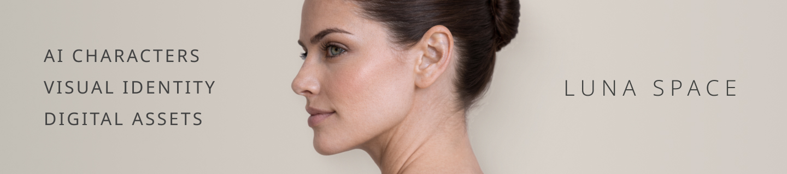

  

# LUNA SPACE

A digital archive of AI characters, neural artifacts and experimental visual identity.

## About

Luna Space is a conceptual design project exploring the intersection of:

- AI-generated personas  
- fashion and identity systems  
- digital assets for brands  
- controlled visual storytelling  

This project is not about trends.  
It is about building **stable, scalable visual identities** that do not depend on changing people, models or production cycles.

## Core Concept

AI personas are treated as **design assets**, not just images.

They are:

- consistent  
- controllable  
- reusable  
- brand-aligned  

Each entity is designed to function inside real product environments:
- e-commerce  
- lookbooks  
- UI systems  
- visual campaigns  

## Featured Entity

### VERA

A universal fashion model designed to demonstrate:

- form  
- silhouette  
- structure  
- close-range realism  

**Core traits:**
- calm  
- controlled  
- neutral  
- non-flirting  

VERA is not a campaign face.  
She is a **scalable system element**.

## Project Structure

index.html → main landing
showcase.html → entity overview
entity-vera.html → detailed persona page
request.html → request / contact form
read-artifact.html → artifact explanation
read-guide.html → usage guide

## Purpose

This repository is also used to practice:

- GitHub workflow  
- version control  
- project structure  
- GitHub Pages deployment  

## Status

Pilot version in progress.

Further improvements will include:
- refined UI system  
- expanded entities  
- interactive elements  
- potential productization  

## Author

Luna Choi  
Product Designer | UX / Web / AI  

